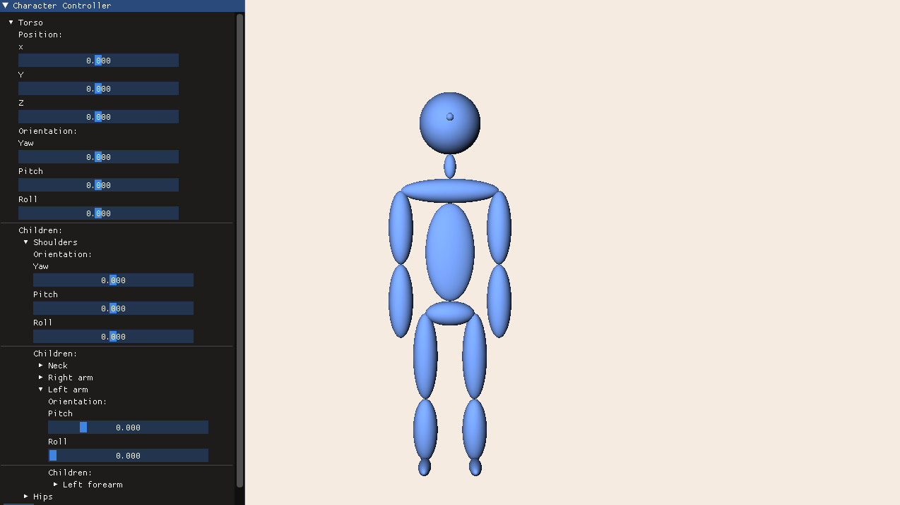

# README | Ze puppet 
## Ricardo Reyes Mercado

Para compilar el archivo, ejecutar el `Makefile` incluido dentro del directorio principal. 

Es necesario utilizar el compilador `gcc` debido a que para implementar una `GLCall()` para el manejo de errores en openGl fue necesario usar una función intrinsica de este compilador.

El `Makefile` asume una instalación interna de **GLEW** y **GLFW** por lo que es necesario tener ambas librerias intaladas en el directorio `usr/include`.

## Directorios

### `GLAux/`

La mayor parte del codigo en este directorio es identico al mostrado en los episodios 13 al 16 de la serie de [turoriales para OpenGL por Cherno.](https://www.youtube.com/playlist?list=PLlrATfBNZ98foTJPJ_Ev03o2oq3-GGOS2) 

Estos archivos son básicamente Wrappers para funciones de OpenGL de manera que se pueda trabajar mas comodamente con ellas.

### `Prim/`

En estos archivos está implementada la clase `Camera` así como un generador para el Mesh de una esfera unitaria.

Este mesh es transformado por la clase Ellipsoide en distintos objetos para reducir la cantidad de memoria de video utilizada (de todos modos la marianota no tiene suficientes ellipsoides para que esto sea un problema real)

### `Model/`

Aquí está implemetada la estructura de un modelo Jerarquico en la clase `Model`. Así mismo está implemetada la función de renderizado y de transformación para el modelo Jerárquico.

La implementación está levemente basada en el capitulo 5 del libro usado en clase. Para más información consultar el pdf de [Design](design.pdf/) adjunto.

### `res/`

Recursos del proyecto. Solo contiene los shaders necesarios para renderizar una fuente de luz y un objeto iluminado por esta. No se utilizaron texturas. Los shaders están basados en la implementación de [Learn OpenGL](https://learnopengl.com/)

### `CharacterController/`

Contiene los controles y la estructura de arbol de los controles para la marioneta implementados con la librería de Dear ImGUI.

### `imgui/`

Directorio *"vendor"* con los archivos de [Dear ImGUI](https://github.com/ocornut/imgui)

## Uso

La aplicación no requiere de parametros de consola y puede utilizarse directamente dando click sobre el ejecutable generado.

Los movimientos disponibles para la marioneta se encuentrar anidados en un menú de árbol representativo de la jerarquía del modelo.

Hasta el final del menú se encuentra el boton **RESET** que devuelve la marioneta a su pocisión original.

## Objetivos no logrados

No pude implementar el stack de ***Undo/Redo*** ya que me quedé sin tiempo, pero ImGUI es capaz de detectar los inicios y los finales de los cambios a cada una de sus componentes gráficas. Ya que solo se hace una operación a la vez siempre, puedo guardar su operación inversa (Lo cual es muy sencillo ya que solo son rotaciones y traslaciones sobre un solo eje) de manera que al hacer ***Undo*** simplemente se hace `Model::nodeUpdate()` con la inversa de la operación hasta arriba del stack (la última en hacerse). Luego, se pasa la inversa de la inversa a otro stack (el stack redo) y al llamarlo, se hace lo mismo que para ***Undo*** pero con la información de este otro stack.